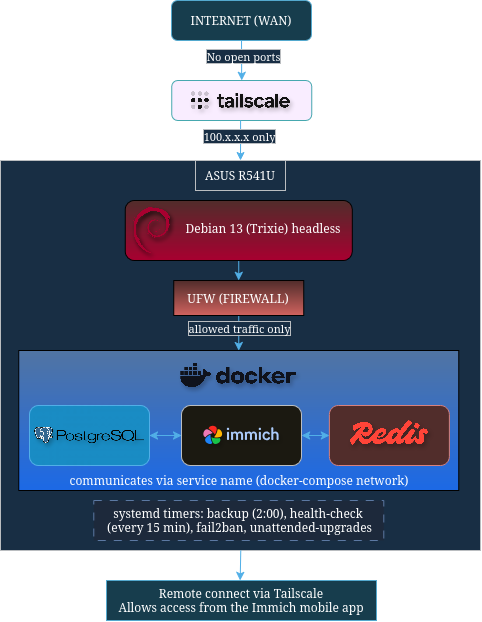

# Architecture and design decisions

## Old laptop instead of dedicated server/NAS

Budget. This laptop had a broken screen and was collecting dust.
Instead of buying new hardware, I gave it a new purpose.

Its battery also works as a built-in UPS. This comes in handy
during power outages.

## Architecture overview



Tailscale creates a private VPN, so I can reach the server remotely
without exposing it to the public internet. UFW only allows traffic
from the Tailscale IP range, blocking everything else. Once traffic
reaches the server, it goes to the right Docker container. Inside
Docker, Immich, PostgreSQL, and Redis talk to each other using service
names declared in docker-compose.yml.

## Why these choices

### Tailscale instead of port forwarding

Port forwarding is a major security risk, exposing the server to bots
and automated scans from the public internet. I chose Tailscale because
it creates a private VPN network, giving access only to devices I've
authorized, with zero visibility from the public internet.

No matter where I go, this lets me connect to my server just as if
I were on my home network.

### Official Docker repository instead of docker.io

It's better to install Docker from the official repository instead of
the Debian package. The docker.io package is older and rarely updated.
This means it's missing the Docker Compose plugin my setup needs.

### ext4 filesystem mandatory for PostgreSQL

Once I eventually buy an external drive, it will likely come formatted
as NTFS by default. Linux can read that fine, but PostgreSQL cannot: it
relies on POSIX file locking, which NTFS doesn't support, and the
database will fail to save data correctly.

### Hardware limitations

The ASUS R541U has 4GB of RAM, which is fine for my simple setup.
Immich's own documentation recommends at least 6GB, and specifically
mentions running with machine learning disabled on 4GB systems
([source](https://docs.immich.app/install/requirements/)). That's why
I disabled it.

### Why Debian instead of Ubuntu or other distribution

Debian is known as a good choice for servers because of its stability
and minimal system overhead.

Unlike a rolling release, Debian freezes package versions for each
stable release. This means less risk of something breaking after an
update. Security patches still come regularly for those frozen
versions, so the system doesn't fall behind on fixes.

### Ethernet over WiFi

A home server constantly sending and receiving data needs stable, fast
bandwidth. Ethernet provides this more reliably than WiFi.

## Directory structure

```
/opt/
├── immich/
│   ├── docker-compose.yml
│   ├── .env
│   ├── library/        # photos
│   └── postgres/       # database
├── scripts/
│   ├── backup.sh
│   ├── health-check.sh
│   ├── update.sh
│   └── logs/
└── backups/             # database dumps + config
```

## Known limitations

- One copy of data. No offsite backup yet, waiting for external drive.
- No hardware redundancy. One disk, one laptop. A failure means downtime.