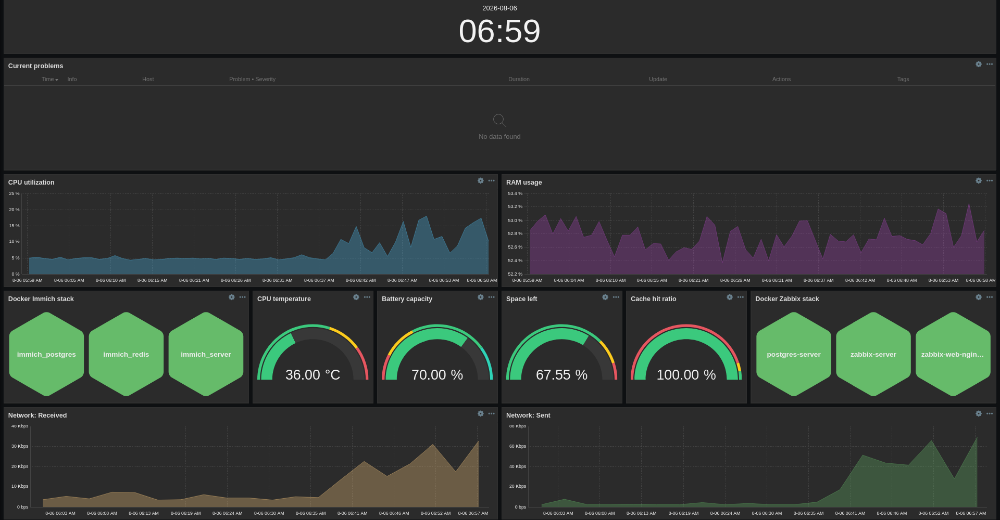

# Monitoring

## Overview

Zabbix is the main monitoring stack right now, covering infrastructure
and application metrics with alerting. Terminal tools like `btop` cover
quick manual checks. Prometheus and Grafana are planned as a separate
stack to learn later.

## Zabbix

### Dashboard

The dashboard shows all the information that matters most to me at a
glance. RAM and CPU utilization over time, status of all Docker
containers (both Immich and Zabbix stacks), gauges for CPU
temperature, battery capacity, disk space left, and PostgreSQL cache
hit ratio, and network speed for both received and sent traffic.

### What's monitored and why

Terminal tools cover quick checks (see next section). Zabbix started
as a learning project, but it now gives me a quick way to check
resource usage without opening a terminal. Graphs over time show how
much load Immich tasks like backups put on the server, and help me
spot unusual behavior. When something goes wrong, I get a
notification on Telegram.

## Terminal tools (btop)

I still use `btop` and other terminal tools for quick checks, even
though I always have Zabbix's dashboard available too. Typing `btop`
is just faster for me than switching to a browser tab. 
For actual troubleshooting, I read logs directly with `journalctl` or
`docker compose logs` (see
[maintenance-schedule.md](maintenance-schedule.md#practicing-log-based-diagnosis)).